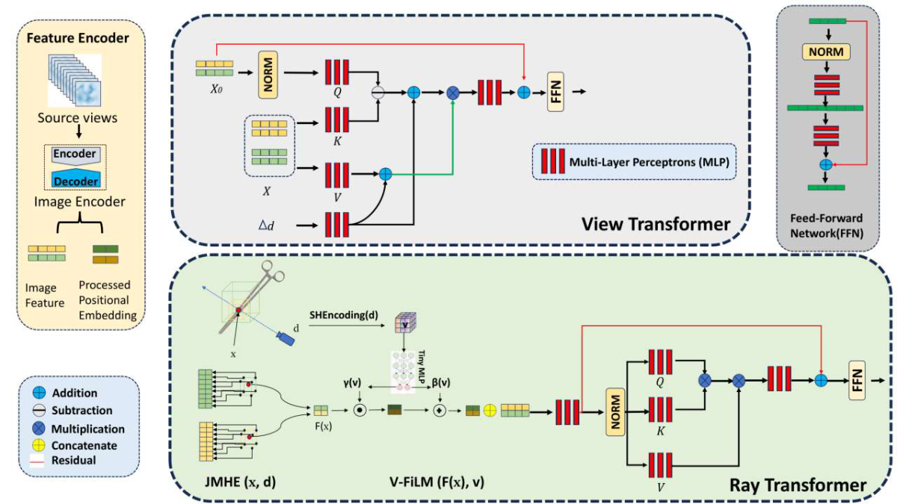

# 🧠 GNFM: Generalizable NeRF with View-Aware Feature Modulation  
### Reflective Surgical Instrument Rendering toward Robot-Assisted Surgery

[]()
[]()
[]()
[]()

---

## ✨ Overview

**GNFM** introduces a *generalizable neural rendering framework* for small, highly reflective surgical instruments — a critical component for **robot-assisted surgery**.  
By extending the Generalizable NeRF Transformer (GNT), GNFM enables **cross-scene generalization**, **fine-structure recovery**, and **view-dependent reflection modeling** without per-scene retraining.

---

## 📄 Abstract

> Accurate 3D reconstruction of small, highly reflective surgical instruments is essential for robust perception and safe robot-assisted surgery.  
> However, conventional NeRFs require dense per-scene training and fail on specular highlights and fine structures.  
> We propose **GNFM (Generalizable NeRF with View-Aware Feature Modulation)** — a framework that integrates:  
> - **Joint Multiresolution Hash Encoder (JMHE)** for joint spatial–directional embedding, and  
> - **View-Conditional Feature-wise Linear Modulation (V-FiLM)** for adaptive, direction-aware feature modulation.  
>  
> Together, they enhance generalization, surface detail recovery, and specular rendering.  
> We also release the **Reflective Surgical Instrument Dataset (RSID)**, containing 8 categories and 2,400 multi-view images.  
>  
> GNFM achieves ~5% improvement in PSNR/SSIM/LPIPS over baselines while maintaining efficiency —  
> a practical step toward *intelligent and safe robot-assisted perception*.

---

## 🧩 Framework

<p align="center">
  
</p>

**Figure:** GNFM architecture extends the Generalizable NeRF Transformer (GNT) with  
(1) a *Joint Multiresolution Hash Encoder (JMHE)* and  
(2) a *View-Conditional Feature-wise Linear Modulation (V-FiLM)*.  
Together, these modules enable direction-aware feature modulation and fine-structure reconstruction.

---

## 📦 Dataset — Reflective Surgical Instrument Dataset (RSID)

| Category | Views | Resolution | Description |
|-----------|--------|-------------|--------------|
| Haemostatic Clamp | 300 | 800×800 | Stainless reflective instrument |
| Curved Needle Holder | 300 | 800×800 | Fine edges & complex reflection |
| DeBakey–Cooley Forcep | 300 | 800×800 | Textured surface |
| Dissecting Forcep | 300 | 800×800 | Thin tip geometry |
| O-ring Forcep | 300 | 800×800 | Ring reflection challenge |
| Scalpel | 300 | 800×800 | High specularity |
| Surgical Blades | 300 | 800×800 | Sharp micro-structures |
| Umbilical Cord Scissor | 300 | 800×800 | Metallic double surface |

📥 **Download:** [Google Drive](#) | [Hugging Face](#)

---

## ⚙️ Installation

```bash
# Clone the repository
git clone https://github.com/yourname/GNFM.git
cd GNFM

# Install dependencies
pip install -r requirements.txt
